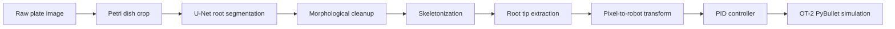

# Architecture

## Pipeline Overview

## Active Modules

- `roots_project.cv.preprocessing`: image loading, Petri dish detection, cropping, patch padding.
- `roots_project.cv.segmentation`: TensorFlow model loading and patch-wise U-Net inference.
- `roots_project.cv.postprocessing`: binary mask cleanup, skeletonization, and root tip extraction.
- `roots_project.cv.coordinates`: image pixel coordinates to robot-space target coordinates.
- `roots_project.simulation.plates`: bundled image/texture pairing and custom UV-atlas generation.
- `roots_project.simulation`: PID control, calibrated specimen placement, droplet physics, and OT-2 orchestration.

## Coordinate System

The CV pipeline emits pixel coordinates as `(row, column)`. The coordinate transform:

- maps image rows to plate X coordinates;
- maps image columns to plate Y coordinates;
- converts millimeters to meters;
- applies calibration offsets for the OT-2 work envelope;
- uses a fixed Z hover height during positioning.

Calibration lives in `PlateCalibration` in `src/roots_project/config.py`.

## Image and Simulation Alignment

`plate_pairs.json` maps each bundled source image to its simulation texture. For a
user-provided image, the Petri dish region used for inference is converted to the
1100 x 1100 UV atlas expected by the specimen URDF.

The simulated specimen bounds come from `PlateCalibration`; the rendered 150 mm plate
and the CV-to-robot coordinate frame therefore share an XY origin. A target is reached
only after both XY and Z converge. Deposition coordinates are recorded at plate contact.
